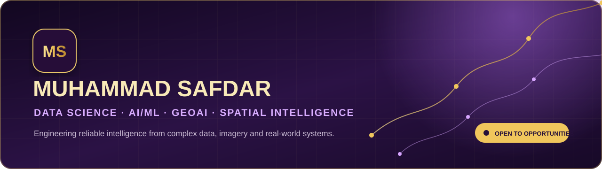

### Data Scientist · AI/ML Engineer · GeoAI & Enterprise GIS Specialist

I transform spatial, engineering and business data into validated analysis, production-minded applications and decision-ready intelligence.

**10+ years professional delivery · Pakistan & GCC experience · Open to global opportunities**

---

## What I deliver

| Capability | Applied work |
|---|---|
| **Data Science & AI** | Classification, regression, forecasting, computer vision, RAG, evaluation and explainable outputs |
| **Data Engineering & APIs** | ETL, SQL, validation, REST APIs, structured/vector data and deployment workflows |
| **GeoAI & Spatial Systems** | Enterprise GIS, remote sensing, urban planning, utilities, disaster intelligence and spatial decision support |
| **Engineering Intelligence** | CAD/BIM-to-GIS, MEP document analysis, GNSS/UAV and infrastructure information workflows |

> **Current focus:** trustworthy GeoAI, agent-ready spatial services, applied AI, data engineering and decision-support products.

## Selected live systems

### 🛰️ GeoSentinel FloodOps — Global Temporal GeoAI
Agentic flood and water intelligence combining temporal Sentinel-1/2 analysis, Leaflet operational maps, exposure/damage assessment, human approval and downloadable operational map products.

**Leaflet · Sentinel-1/2 · Google Earth Engine · Python GeoAI · PostGIS · Agentic AI**

[Open GeoSentinel FloodOps](https://safdar404.github.io/geosentinel-floodops/)

### 🗺️ Pakistan Infrastructure GIS Command Centre
Infrastructure and transportation GIS dashboard for spatial decision support, project monitoring and public-development workflows.

[Open command centre](https://pmu-pdp-infrastructure-gis.neat-grove-8624.chatgpt.site/)

### 🌍 GeoAI Resilience Intelligence Suite
Five program-specific workflows for urban suitability, flood response, utility risk, drainage capacity and Earth-observation change.

**GeoAI · GIS · MCDA · Remote Sensing · Spatial QA**

[Live suite](https://geoai-resilience-intelligence-suite.neat-grove-8624.chatgpt.site) · [Research repository](https://github.com/safdar404/geoai-resilience-research-lab)

### 🌊 Pakistan Flood Intelligence
Decision-support view combining weather outlooks, dated impacts, river context, preparedness guidance and map-based decisions.

**GeoAI · Risk Analytics · Web Mapping · Data Visualization**

[Live system](https://pakistan-flood-intelligence-2026.neat-grove-8624.chatgpt.site/) · [Source](https://github.com/safdar404/Pakistan-National-Flood-Intelligence)

### 📊 Prediction Studio
Applied ML workflows covering health-risk prediction, hospital intelligence, healthcare stock forecasting and FDA-device analysis.

**scikit-learn · TensorFlow · FastAPI · Python**

[Live dashboards](https://prediction-api-dashboard-hub.neat-grove-8624.chatgpt.site) · [Source](https://github.com/safdar404/Fullstack-AI-BOOTCAMP-B-10)

### 📚 LangChain RAG Assistant
Document ingestion, retrieval and evidence-grounded question answering with transparent source handling.

**Python · LangChain · RAG · Vector Search**

[Live assistant](https://langchain-rag-document-assistant.neat-grove-8624.chatgpt.site) · [Source](https://github.com/safdar404/LangChain-RAG-Application)

### 🏗️ MEP Scanner System
Engineering-document intelligence for drawing ingestion, OCR-assisted extraction and structured MEP findings.

**OCR · Computer Vision · Engineering AI · Data Extraction**

[Live system](https://mep-scanner-system.neat-grove-8624.chatgpt.site) · [Source](https://github.com/safdar404/HIS-MEP-Scanner-System.)

## Technology stack

**AI & Data Science:** Python, Pandas, NumPy, scikit-learn, TensorFlow/Keras, OpenCV, Hugging Face, LangChain, RAG  
**Data & APIs:** SQL, PostgreSQL/PostGIS, SQLite, ETL, FastAPI, Flask, REST, Streamlit, Docker  
**GIS & Remote Sensing:** ArcGIS Pro/Enterprise, QGIS, Google Earth Engine, FME, Agisoft Metashape  
**Geospatial Python:** ArcPy, GeoPandas, GDAL, Rasterio, Shapely, Fiona, PyProj, Folium, Leaflet  
**Engineering & Cloud:** AutoCAD, Civil 3D, BIM/IFC, CAD-to-GIS, Power BI, AWS, Azure, Google Cloud

## Professional delivery

| Period | Role & organization | Selected contribution |
|---|---|---|
| **2025—Present** | **GIS & GeoAI Specialist · Professional Geo Tech Services FZC LLC** | NWC Riyadh wastewater mapping, infrastructure/GNSS delivery and environmental spatial analysis |
| **2023—2025** | **GIS Expert · TerraSense Consulting** | GeoAI land-cover workflows, satellite crop intelligence, wheat estimation and predictive analysis |
| **2021—2023** | **GIS Specialist · FGEHA, Islamabad** | Enterprise geodatabases, CAD-to-GIS, topology QA and training of 20+ personnel |
| **2019—2021** | **GIS Manager · Kernel Seeds Corporation** | Agricultural GIS, crop analysis, spatial repositories and data governance |
| **2017—2019** | **GIS Manager · PDMA Punjab** | Chenab/Sutlej flood intelligence, exposure analysis and emergency situation mapping |
| **2012—2017** | **GIS Professional · The Urban Unit & Loyal Consultants** | Urban, land, infrastructure, survey GIS, spatial databases and cartographic production |

## Education & credentials

- **MSc Geographic Information Systems** — University of the Punjab, Lahore
- **BSc Computer Science, Economics & Statistics** — The Islamia University of Bahawalpur
- **Python with Full Stack AI** — NexSkills, 2026
- **Artificial Intelligence Using Python** and **Data Analytics & Business Intelligence** — DigiSkills, 2026
- **AWS Cloud Practitioner Essentials** · **Cisco Python Essentials 1**
- **GACA Remote Pilot Certificate** · **Esri Spatial Data Science, Imagery and Cartography training**

## Contact

### Building reliable intelligence for real-world decisions.

Open to **Data Science, Data Engineering, AI/ML Engineering, Python, GIS, GeoAI and technical leadership** opportunities in Pakistan, the GCC and globally.

[Portfolio](https://safdar404.github.io/) · [LinkedIn](https://www.linkedin.com/in/muhammad-safdar-88b27730) · [Email](mailto:safdar404@gmail.com) · [WhatsApp](https://wa.me/923228792404) · [Resume](https://smhisresume.com/)

