

### Data Scientist · AI/ML Engineer · GeoAI & Enterprise GIS Specialist

I transform spatial, engineering and business data into validated analysis, production-minded applications and decision-ready intelligence.

**15+ years professional delivery · Pakistan & GCC experience · Open to global opportunities**

---

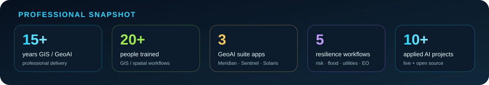

## What I deliver

| Capability | Applied work |
|---|---|
| **Data Science & AI** | Classification, regression, forecasting, computer vision, RAG, evaluation and explainable outputs |
| **Data Engineering & APIs** | ETL, SQL, validation, REST APIs, structured/vector data and deployment workflows |
| **GeoAI & Spatial Systems** | Enterprise GIS, remote sensing, urban planning, utilities, disaster intelligence and spatial decision support |
| **Engineering Intelligence** | CAD/BIM-to-GIS, MEP document analysis, GNSS/UAV and infrastructure information workflows |

> **Current focus:** trustworthy GeoAI, agent-ready spatial services, applied AI, data engineering and decision-support products.

---

## 📊 Power BI & Decision Intelligence

### Superstore Sales Intelligence

An end-to-end sales analytics case study using the supplied Superstore workbook. The source contains **5,899 order lines** and **3,002 distinct orders** from January 2019 through December 2020. The published dashboard supports year, region, category and customer-segment filters. The repository documents the Power BI data model and DAX measures for a Desktop implementation.

| KPI | 2019–2020 |
|---|---:|
| Sales | **$1,342,420.85** |
| Profit | **$175,234.44** |
| Profit margin | **13.1%** |
| Units sold | **22,313** |

**Visual analysis:** Monthly trend, category ranking, regional profit, customer-segment mix, diverging subcategory profit and quarterly geographic intensity.\n\n**Findings:** 2020 sales reached $733,215, up 20.4% from 2019. Technology generated $498,095 in sales and $90,458 in profit. Furniture generated $414,289 in sales but only $9,978 in profit; Tables alone lost $11,092. The West contributed the highest regional profit at $67,861.

  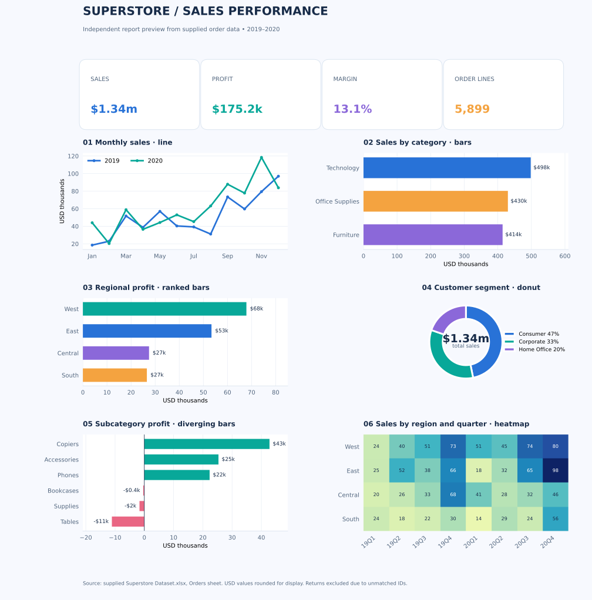

**Model and quality checks:** Order Date links to a Date dimension; measures cover sales, profit, margin, distinct orders, units and average order value. The workbook's Returns sheet has 296 distinct IDs, with **zero matches** against Orders, so a return rate is excluded. The public dashboard uses grouped figures without customer or order identifiers.

  <a href="https://safdar404.github.io/superstore-bi/"><strong>View interactive dashboard →</strong></a>
  &nbsp;&nbsp;·&nbsp;&nbsp;
  <a href="https://github.com/safdar404/safdar404.github.io/tree/main/superstore-bi"><strong>Read the Power BI build guide →</strong></a>

**Tools:** Power BI model design · DAX · Power Query workflow · Python data validation · interactive web visualization

*The live dashboard is a web demonstration. The repository includes the Power BI Desktop build instructions; a native .pbix file has not been published.*

### Laptop Sales & Pricing Intelligence

A new analysis of **4,446 laptop listings** and **$205.07 million in reported sales**. It compares brands, CPU families, price bands and graphics types, with brand-level pricing and coverage of ratings and stock. The dashboard filters by brand and graphics configuration.

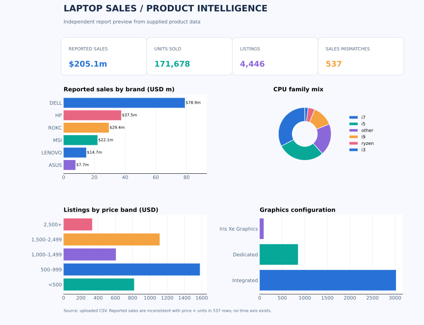

**Data quality:** 537 rows have reported sales that differ from price × units by more than $1, and the dataset has no transaction dates. The supplied archive includes a Power BI report credited to Sridhar Kamali; this independent dashboard uses its CSV and does not claim authorship of that report.

[**View laptop dashboard →**](https://safdar404.github.io/laptop-intelligence/) · [Power BI model guide](https://github.com/safdar404/safdar404.github.io/tree/main/laptop-intelligence)

### Customer Purchase Intelligence

A customer-sales case study drawn from a file labeled as a hiring assessment. After removing one exact duplicate, **99 purchases total 34,400 source currency units** across 2016–2019. The public dashboard explores year, country, product and age-band mix without customer names or identifiers.

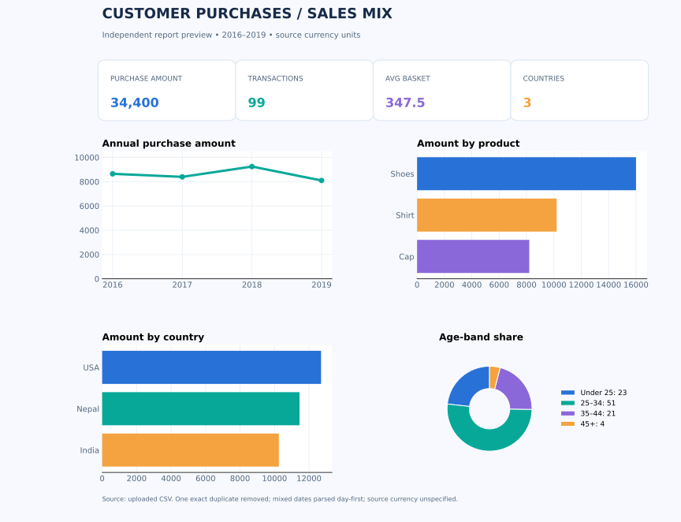

**Data quality:** Mixed date strings were interpreted day-first; the source does not specify a currency. The dashboard documents both assumptions.

[**View customer dashboard →**](https://safdar404.github.io/customer-purchase-intelligence/) · [Power BI model guide](https://github.com/safdar404/safdar404.github.io/tree/main/customer-purchase-intelligence)

---

## ⭐ Featured project — GeoAI Site Intelligence Suite

<a href="https://safdar404.github.io/geoai-site-intelligence/">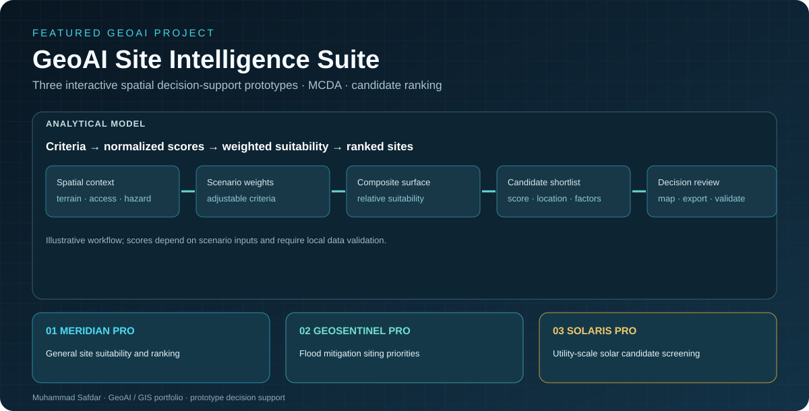</a>

[**MERIDIAN PRO**](https://safdar404.github.io/geoai-site-intelligence/meridian-pro.html) · [**GEOSENTINEL PRO**](https://safdar404.github.io/geoai-site-intelligence/geosentinel-pro.html) · [**SOLARIS PRO**](https://safdar404.github.io/geoai-site-intelligence/solaris-pro.html) · [Methodology](https://github.com/safdar404/safdar404.github.io/tree/main/geoai-site-intelligence)

*Illustrative decision-support prototypes; validate local inputs before real-world use.*

---

## 🚀 Selected projects

| Project gallery | Project gallery |
|:---|:---|
| <a href="https://ai-healthassist.ai.studio/">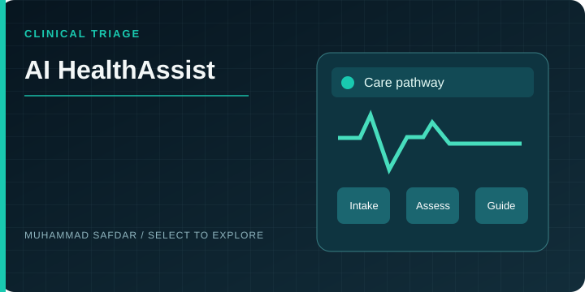</a> <a href="https://ai-healthassist.ai.studio/">View project →</a> · <a href="https://github.com/safdar404/HIS-AI-HealthAssist">Source</a> | <a href="https://safdar404.github.io/geosentinel-floodops/">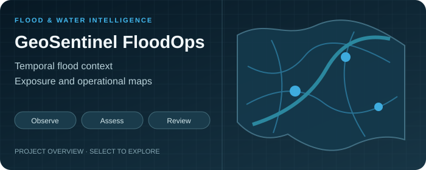</a> <a href="https://safdar404.github.io/geosentinel-floodops/">View project →</a> |
| <a href="https://pmu-pdp-infrastructure-gis.neat-grove-8624.chatgpt.site/">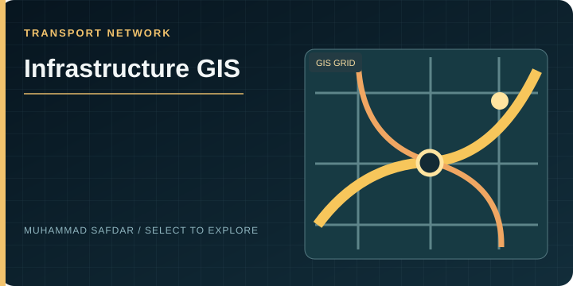</a> <a href="https://pmu-pdp-infrastructure-gis.neat-grove-8624.chatgpt.site/">View project →</a> | <a href="https://geoai-resilience-intelligence-suite.neat-grove-8624.chatgpt.site">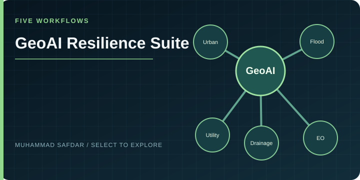</a> <a href="https://geoai-resilience-intelligence-suite.neat-grove-8624.chatgpt.site">View project →</a> · <a href="https://github.com/safdar404/geoai-resilience-research-lab">Source</a> |
| <a href="https://pakistan-flood-intelligence-2026.neat-grove-8624.chatgpt.site/">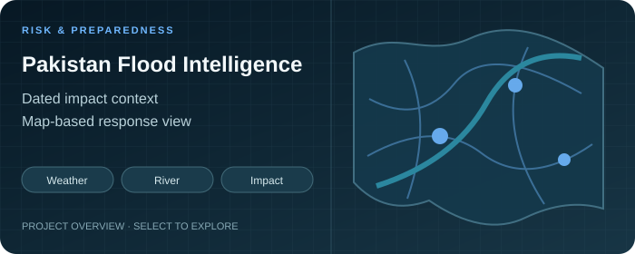</a> <a href="https://pakistan-flood-intelligence-2026.neat-grove-8624.chatgpt.site/">View project →</a> · <a href="https://github.com/safdar404/Pakistan-National-Flood-Intelligence">Source</a> | <a href="https://prediction-api-dashboard-hub.neat-grove-8624.chatgpt.site">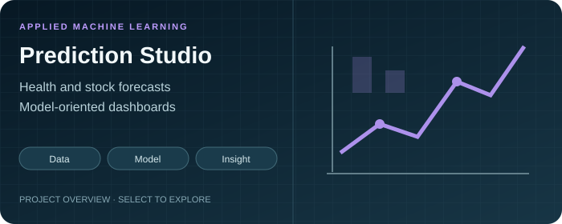</a> <a href="https://prediction-api-dashboard-hub.neat-grove-8624.chatgpt.site">View project →</a> · <a href="https://github.com/safdar404/Fullstack-AI-BOOTCAMP-B-10">Source</a> |
| <a href="https://langchain-rag-document-assistant.neat-grove-8624.chatgpt.site">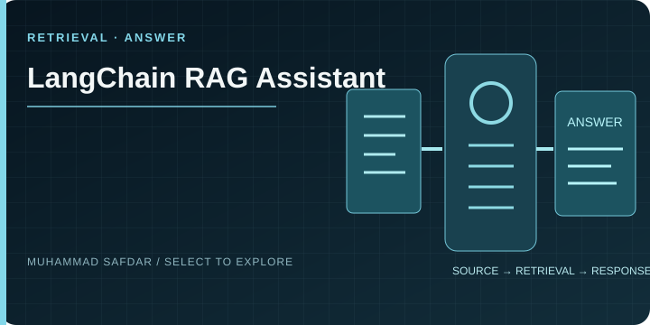</a> <a href="https://langchain-rag-document-assistant.neat-grove-8624.chatgpt.site">View project →</a> · <a href="https://github.com/safdar404/LangChain-RAG-Application">Source</a> | <a href="https://mep-scanner-system.neat-grove-8624.chatgpt.site">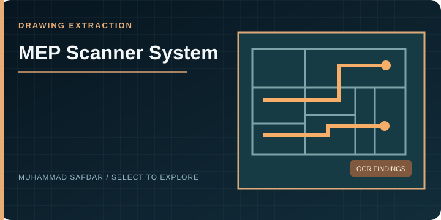</a> <a href="https://mep-scanner-system.neat-grove-8624.chatgpt.site">View project →</a> · <a href="https://github.com/safdar404/HIS-MEP-Scanner-System.">Source</a> |
| <a href="https://ai-cad-bim-flow.lovable.app/">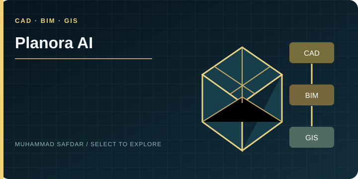</a> <a href="https://ai-cad-bim-flow.lovable.app/">View project →</a> · <a href="https://github.com/safdar404/ai-cad-bim-flow">Source</a> | <a href="https://github.com/safdar404/mep-analyzer">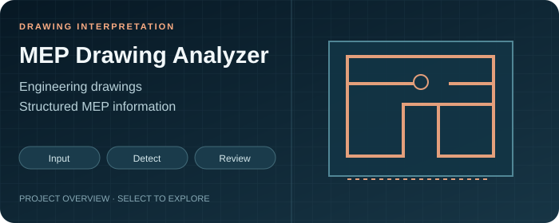</a> <a href="https://github.com/safdar404/mep-analyzer">View project →</a> |
| <a href="https://github.com/safdar404/alfanar-mep-ocr">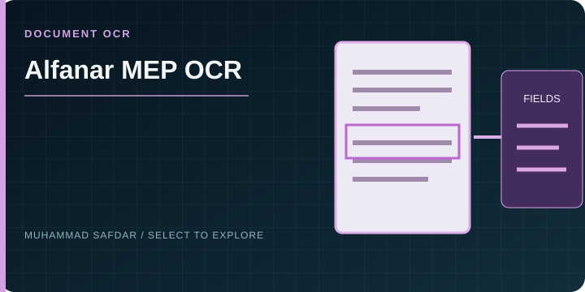</a> <a href="https://github.com/safdar404/alfanar-mep-ocr">View project →</a> | <a href="https://github.com/safdar404/zarwa-bill-scanner">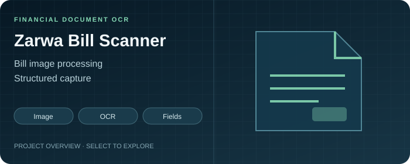</a> <a href="https://github.com/safdar404/zarwa-bill-scanner">View project →</a> |
| <a href="https://safdar404.github.io/python-ai-lab/">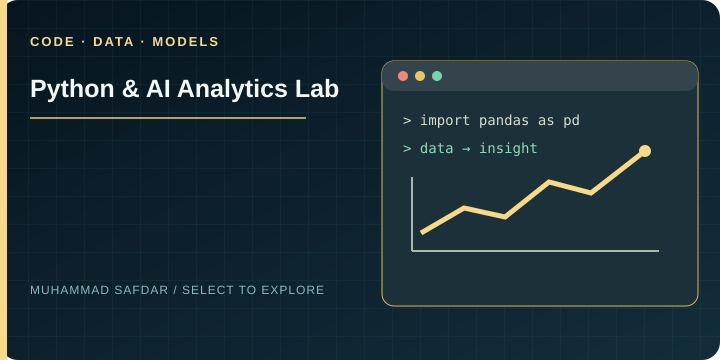</a> <a href="https://safdar404.github.io/python-ai-lab/">View project →</a> |  |

> **AI-HealthAssist:** Educational decision support only; it does not replace professional clinical diagnosis or treatment. Project capabilities and deployment status should be evaluated in the linked applications and repositories.

---

## Technology stack

**AI & Data Science:** Python, Pandas, NumPy, scikit-learn, TensorFlow/Keras, OpenCV, Hugging Face, LangChain, RAG  
**Data & APIs:** SQL, PostgreSQL/PostGIS, SQLite, ETL, FastAPI, Flask, REST, Streamlit, Docker  
**GIS & Remote Sensing:** ArcGIS Pro/Enterprise, QGIS, Google Earth Engine, FME, Agisoft Metashape  
**Geospatial Python:** ArcPy, GeoPandas, GDAL, Rasterio, Shapely, Fiona, PyProj, Folium, Leaflet  
**Engineering & Cloud:** AutoCAD, Civil 3D, BIM/IFC, CAD-to-GIS, Power BI, AWS, Azure, Google Cloud

## Professional delivery

| Period | Role & organization | Selected contribution |
|---|---|---|
| **2025—Present** | **GIS & GeoAI Specialist · Professional Geo Tech Services FZC LLC** | NWC Riyadh wastewater mapping, infrastructure/GNSS delivery and environmental spatial analysis |
| **2023—2025** | **GIS Expert · TerraSense Consulting** | GeoAI land-cover workflows, satellite crop intelligence, wheat estimation and predictive analysis |
| **2021—2023** | **GIS Specialist · FGEHA, Islamabad** | Enterprise geodatabases, CAD-to-GIS, topology QA and training of 20+ personnel |
| **2019—2021** | **GIS Manager · Kernel Seeds Corporation** | Agricultural GIS, crop analysis, spatial repositories and data governance |
| **2017—2019** | **GIS Manager · PDMA Punjab** | Chenab/Sutlej flood intelligence, exposure analysis and emergency situation mapping |
| **2012—2017** | **GIS Professional · The Urban Unit & Loyal Consultants** | Urban, land, infrastructure, survey GIS, spatial databases and cartographic production |

## Education & credentials

- **MSc Geographic Information Systems** — University of the Punjab, Lahore
- **BSc Computer Science, Economics & Statistics** — The Islamia University of Bahawalpur
- **Python with Full Stack AI** — NexSkills, 2026
- **Artificial Intelligence Using Python** and **Data Analytics & Business Intelligence** — DigiSkills, 2026
- **AWS Cloud Practitioner Essentials** · **Cisco Python Essentials 1**
- **GACA Remote Pilot Certificate** · **Esri Spatial Data Science, Imagery and Cartography training**

## Contact

### Building reliable intelligence for real-world decisions.

Open to **Data Science, Data Engineering, AI/ML Engineering, Python, GIS, GeoAI and technical leadership** opportunities in Pakistan, the GCC and globally.

[Portfolio](https://safdar404.github.io/) · [LinkedIn](https://www.linkedin.com/in/muhammad-safdar-88b27730) · [Facebook](https://www.facebook.com/muhammad.safdar.615557) · [Email](mailto:safdar404@gmail.com) · [WhatsApp](https://wa.me/923228792404) · [Resume](https://smhisresume.com/)

